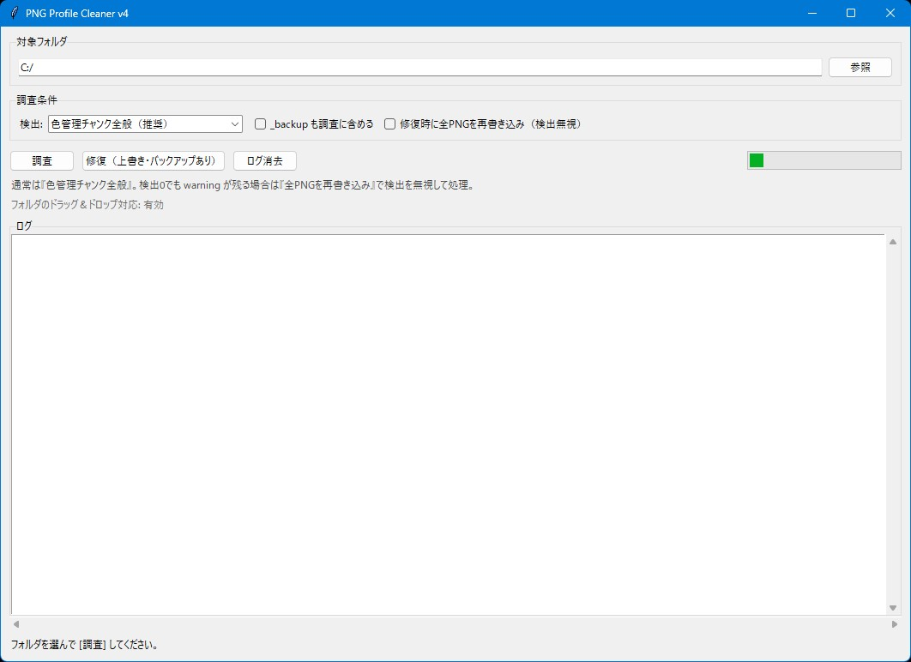

# PNG Profile Cleaner



## 機能概要

PNG画像に含まれるICCプロファイルや色管理系メタデータを調査・修復するGUIツールです。
`libpng warning: iCCP: known incorrect sRGB profile` のようなログ警告が気になるときに、対象フォルダ内のPNGをまとめてチェック＆クリーンアップできます。

### 主な機能

* 日本語GUIでPNG画像のプロファイル／メタデータを調査
* 指定フォルダ以下のPNGをサブフォルダ含めて再帰的にチェック
* `iCCP`、`sRGB`、`gAMA`、`cHRM` などの色管理チャンクを検出
* 検出されたPNGをPillowで再保存して、不要なプロファイル情報を削除
* 検出に引っかからない場合でも、全PNGを強制再書き込みするオプションあり
* 修復前のファイルを `_backup` フォルダへ自動バックアップ
* `_backup` フォルダを調査対象に含めるかどうかを切り替え可能
* APNGはアニメーション破損防止のため修復対象からスキップ
* フォルダのドラッグ＆ドロップに対応
  ※ `tkinterdnd2` が入っている場合のみ
* 前回使用したフォルダや設定をJSONに保存・復元

### 一言で言うと

「PNGの余計なプロファイル情報を消して、libpng warningを減らすツール」

## 使い方

1. **アプリを起動する**

   ターミナルで以下を実行します。

   ```bash
   python png-icc-cleaner.py
   ```

   必要ライブラリはPillowです。

   ```bash
   pip install pillow
   ```

   フォルダのドラッグ＆ドロップも使いたい場合は、追加で以下を入れてください。

   ```bash
   pip install tkinterdnd2
   ```

2. **フォルダを読み込む**

   `参照` ボタンからPNG画像が入っているフォルダを選択します。
   `tkinterdnd2` が入っている環境では、フォルダをウィンドウにドラッグ＆ドロップすることもできます。

   対応形式は `.png` です。
   サブフォルダ内のPNGもまとめて調査します。

3. **設定を行う**

   主な設定項目は以下です。

   * **検出**

     * `iCCPのみ（warning本命）`
     * `色管理チャンク全般（推奨）`
     * `メタデータ全般（広め）`
   * **_backup も調査に含める**

     * 通常はOFFでOKです。
     * バックアップ内のPNGも調べたい場合だけONにします。
   * **修復時に全PNGを再書き込み（検出無視）**

     * 調査で候補が0件なのにwarningが残る場合に使います。
     * 対象フォルダ内のPNGをすべてPillowで再保存します。

4. **調査を実行する**

   `調査` ボタンを押すと、指定フォルダ内のPNGをチェックします。
   見つかった候補はログ欄に表示されます。

5. **修復を実行する**

   `修復（上書き・バックアップあり）` ボタンを押すと、対象PNGを修復します。

   修復前のファイルは以下のように `_backup` フォルダへ保存されます。

   ```text
   対象フォルダ/_backup/元の相対パス
   ```

   既に同名のバックアップがある場合は上書きします。

## おすすめ設定例

通常は以下の設定がおすすめです。

* 検出: `色管理チャンク全般（推奨）`
* `_backup も調査に含める`: OFF
* `修復時に全PNGを再書き込み（検出無視）`: OFF

これで見つからないのにまだwarningが出る場合は、次の設定で再修復します。

* `修復時に全PNGを再書き込み（検出無視）`: ON

ゲーム素材やGUI素材のPNGなら、ICCプロファイルを保持する必要がないことも多いので、まとめて再保存してログ警告を潰す用途に向いています。

## 設定ファイルについて

前回使用したフォルダやチェック状態は、スクリプトと同じフォルダに保存されます。

```text
png-icc-cleaner-settings.json
```

次回起動時に自動で読み込まれるので、毎回フォルダを選び直す手間を減らせます。

## 必要環境

* Python 3.10以上
* Pillow
* tkinter
  ※通常のPython環境なら標準で入っています
* tkinterdnd2
  ※ドラッグ＆ドロップを使う場合のみ

インストール例:

```bash
pip install pillow
```

ドラッグ＆ドロップも使う場合:

```bash
pip install pillow tkinterdnd2
```

## ライセンス

**MIT License** で公開しています。
ご自由に使って、改変して、参考にしてください。
ただし**自作発言はNG**でお願いします。
